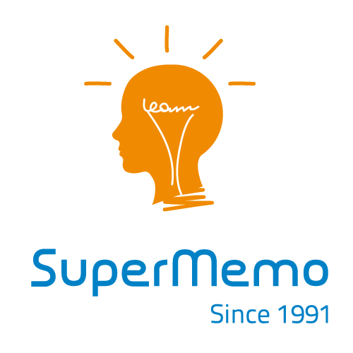

<div align="center"></div>
<h1 align="center">SuperMemo</h1>

<div align="center">


</div>

## Table of Contents
- [Table of Contents](#table-of-contents)
- [📖 About](#-about)
- [✨ Features](#-features)
- [📦 Structure](#-structure)
- [📚 Libraries](#-libraries)
- [🔧 Build](#-build)
  - [Nix (recommended for MacOS and Linux)](#nix-recommended-for-macos-and-linux)
  - [Windows (WSL)](#windows-wsl)
- [🚀 Releases](#-releases)
- [📜 License](#-license)


## 📖 About

This is a shcool project in which we were tasked to build a simple flashcard application like
[**Anki**](https://apps.ankiweb.net/), with a UI for the user to interact with. It could have been a
TUI, but we decided to make a GUI (because it's better), and here it is.

We were required to:

* Implement the [SM2](https://www.super-memory.com/english/ol/sm2.htm) algorithm
* Program a flashcard app like **Anki**
* Build a UI for users to interact with the application

The UI should allow the user to:

* Create, Edit and Delete flashcards
  * Each flashcard contained a **question**, an **answer** and a *hint*
* Create, Edit and Delete decks of mulitple flashcards
* Save all the informatons across application reruns (in files)
* Show flashcards to the user during reminding sessions at intervals following the SM2 algorithm
  output patterns

## ✨ Features

**Project**

- 🔄 **Reproducible**: Built with Nix, this configuration can be effortlessly reproduced on other
  machines, ensuring a consistent setup.

- 📖 **Documented**: Most of the parts of my configuration files are commented and documented with
  links and explanations if necessary

**Application**
- Flashcard app inspired by [**Anki**](https://apps.ankiweb.net/)
- Graphical User Interface (GUI) for user interaction
- Implements the [SM2](https://www.super-memory.com/english/ol/sm2.htm) spaced repetition algorithm
- Allows users to:
  - Create, edit, and delete flashcards
    - Each flashcard includes:
      - A **question**
      - An **answer**
      - A *hint*
  - Create, edit, and delete decks containing multiple flashcards
  - Save all data persistently across sessions (using files)
  - Review flashcards in timed sessions based on SM2 scheduling


## 📦 Structure

- **Directories**

  - [**`includes`**](./includes/) - Headers (`.hpp/.h`)
  - [**`src`**](./src/) - Source files (`.cpp`)
  - [**`libs`**](./libs/) - External libraries
  - [**`assets`**](./assets/) - Images and other Resources.

- **Files**

  - `flake.nix` - Environment configuration (based on
    [**dev-templates**](https://github.com/the-nix-way/dev-templates))
  - `.envrc` - Used by **direnv** to load **Flakes**
  - `flake.lock` - Used by **Flakes** to version packages

## 📚 Libraries

- [**Dear ImGui**](https://github.com/ocornut/imgui) ~ Bloat-free Graphical User interface for C++
  with minimal dependencies
- [**SFML**](https://github.com/SFML/sfml) ~ Simple and Fast Multimedia Library

## 🔧 Build

### Nix (recommended for MacOS and Linux)

> [!NOTE]
>
> I'm using NixOS as my day-to-day OS, and I have found that **Nix** with **Flakes** was the
> simplest and fastest way for me to setup C/C++ project with external libraries.

To build this project, first make sure you have [Nix](https://nixos.org/download/) installed as a
package manager and [direnv](https://direnv.net/) as a shell extension.

Then, configure it to enable [Flakes](https://nixos.wiki/wiki/flakes) according to your setup.

Once you're ready, you can start by cloning this repo

```bash
git clone https://github.com/leoraclet/super-memo
cd super-memo
```

> [!TIP]
>
> Now, **direnv** should load the environment when inside the project directory, if not, try
> ```bash
> direnv allow
> ```

The `flake.nix` file is where the project's environment is defined, and you can see in it that
[CMake](https://cmake.org/) is part of the packages. So, if everything went well, you should be able
to build the project like so

```bash
cmake -B build -S .
cd build
cmake --build .
```

Then, you can run the produced executable in `build` with

```basb
./supermemo
```

### Windows (WSL)

> [!WARNING]
>
> I have **NOT** tested the building process on Windows, so you're basically on your own for this.

The best solution to build this project on Windows is to use
[WSL](https://learn.microsoft.com/en-us/windows/wsl/install) and follow the
[Nix](#nix-recommended-for-macos-and-linux) way in it.

You can start by installing nix [here](https://nixos.org/download/#nix-install-windows).

## 🚀 Releases

To run the program without editing the source code or building it yourself, go see the
[**Releases**](https://github.com/leoraclet/super-memo/releases).
## 📜 License

This project is licensed under the MIT License - see the [LICENSE](LICENSE) file for details.